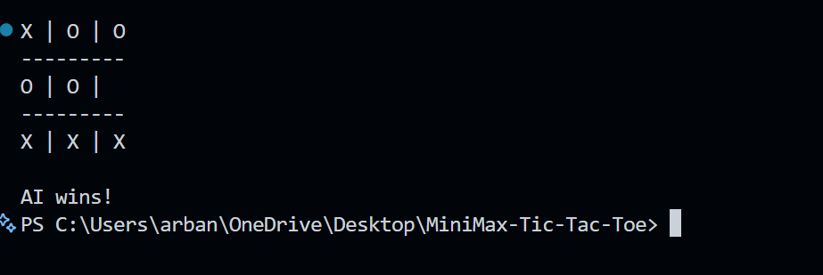

# MiniMax Tic Tac Toe



MiniMax Tic Tac Toe is a simple command-line Tic-Tac-Toe game where the AI uses the Minimax algorithm to play optimally.

**Features**

- Human vs AI (human plays `O`, AI plays `X`)
- Optimal AI using Minimax
- Simple CLI interface

**Demo**

- See the demo image in `public/images` above.

**Installation**

1. Ensure you have Node.js installed (Node 14+ recommended).
2. From the project root, install dependencies:

```
npm install
npm install prompt
```

**Usage**

Run the game with:

```
node script.js
```

**Controls**

- Enter a number from 1 to 9 to place your `O` on the board using this mapping:

```
1 | 2 | 3
---------
4 | 5 | 6
---------
7 | 8 | 9
```

**How it works**

- The AI evaluates moves using the Minimax algorithm to choose the optimal play. Wins and losses are scored with depth adjustment so the AI prefers quicker wins and longer losses.

**Contributing**

- Feel free to open issues or submit pull requests to improve the UI or add features.

**License**

- MIT
